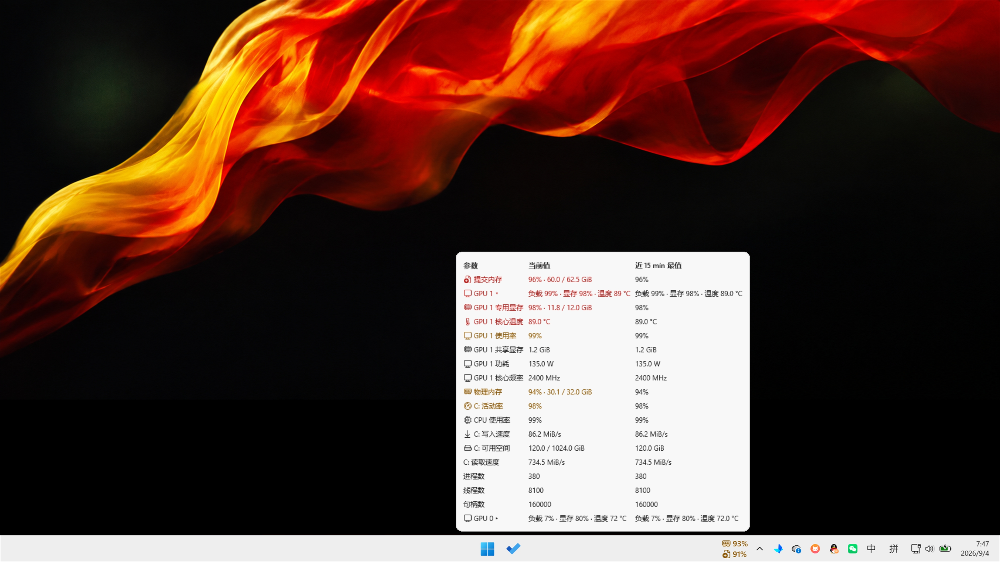

# Windhawk System Resource Alert

Windows 11 任务栏系统资源告警组件。仅在资源持续超出阈值时显示透明的「图标 + 数值」，点击后展开圆角资源总表。

**版本：0.8.4 · 许可证：GPL-3.0-only · 平台：Windows 11 x64**

展示图使用模拟资源数据；桌面背景为示意，任务栏来自脱敏素材，不包含窗口标题、设备名称或账号信息。

## 功能

- CPU、物理内存、提交内存、系统盘剩余空间 / 活动率 / 读写速度，以及各物理 GPU 的负载、显存和可用核心温度。
- 任务栏和总表统一使用微软 Fluent UI System Icons 的 16 px 矢量轮廓：CPU 芯片、内存条、提交页、硬盘、仪表、持续写入、显示设备、显存和温度均可直接区分。
- 告警位于系统托盘左侧。恰好三项时缩小内容并放在一列；四项及以上恢复每列上下两项，向左扩展。
- 使用原生 XAML 文本与矢量图标，保留抗锯齿。任务栏内无底色，不创建独立悬浮窗口。
- 没有告警时完全隐藏，不保留入口图标、不占任务栏空间。
- 点击告警打开三列表格：参数、当前值、近 15 min 最值。严重、告警和确认中的项目优先。
- 有对应图标的参数会在名称前显示图标。每张物理 GPU 有独立折叠行；折叠时只显示该卡的负载、专用显存和温度，展开后显示完整读数，多张显卡互不混合。
- 无法读取或过期的数据不列入表格。三列内容保持单行、不换行并按最长文本自适应宽度；弹窗横向与告警组件右侧对齐，纵向固定在任务栏上沿之上并保留原生小间隙，不随告警行高漂移。整表无需滚动或翻页，内容过多时并排排列，极小工作区下按需整体缩放。
- 最值使用滚动 15 分钟的有效采样：磁盘可用空间取最低值，其他参数取最高值，不再附加最低值箭头。窗口到期的样本自动移出。
- 运行不足 15 分钟时只统计已有数据；数据仅保存在内存中，不生成历史文件。
- 系统盘活动率达到 90% 会累计繁忙时间；写入达到 5 MiB/s 会累计持续写盘时间。两者允许最多 5 秒短暂回落，分别累计 60 秒和 180 秒后告警。读取速度仅作诊断；写入规则用于发现持续后台流量，不代表磁盘健康或性能上限。

图标含义：芯片 = CPU，内存条 = 物理内存，带加号的文档 = 提交内存，硬盘 = 剩余空间，仪表 = 磁盘活动率，向下箭头 = 持续写入，显示器 = GPU，内存芯片 = 专用显存，温度计 = 温度。小尺寸下不再拼接两个设备图案。

## 安装

1. 安装并打开 [Windhawk](https://windhawk.net/)。
2. 在 Windhawk 中选择「创建新模组」（Create a new mod）。
3. 打开本仓库的 [system-resource-alert.wh.cpp](system-resource-alert.wh.cpp)，复制**全部内容**，替换编辑器中的模板。
4. 按 **Ctrl+B** 编译并启用。需要时在模组设置页调整告警阈值。
5. 无告警时任务栏不会显示任何图标，这是预期行为。告警出现后点击图标即可打开总表。

本仓库发布源码、文档和模拟展示图，不提供预编译 DLL。首次编译 / 符号解析所需的下载由 Windhawk 自身处理。

升级时同样全文替换并重新编译。默认使用 18 DIP 行高、零行间距；旧版保存的“正常时显示入口”设置已停用。若需自定义行高，先开启 **Use custom row spacing**。

## 数据来源

| 参数 | 来源 / 行为 |
| --- | --- |
| CPU、内存、提交量、进程 / 线程 / 句柄数 | Windows 系统 API |
| 系统盘可用空间 | 从 Windows 所在盘获取，不固定监控某个私人路径 |
| 系统盘活动率、读取 / 写入速度 | Windows PDH `LogicalDisk` 性能计数器；首个采样周期用于建立基线，不显示伪造零值 |
| GPU 使用率和显存 | NVIDIA NVML（可用时），以及 Windows PDH 性能计数器 |
| GPU 核心温度 | NVML 或 Windows D3DKMT 提供的读数，取决于驱动支持 |
| CPU 温度（可选） | 正在运行的 LibreHardwareMonitor 的本机 Web Server；兼容旧版 WMI |

每张 GPU 单独监测，最多八张物理适配器。集成显卡小于 1 GiB 的预留专用显存不会触发显存占用告警，共享内存压力由系统内存指标反映。

### 可选 CPU 温度

运行 [LibreHardwareMonitor](https://github.com/LibreHardwareMonitor/LibreHardwareMonitor)，开启其 Web Server。默认端口为 8085，可在模组设置中调整。

模组只向 `127.0.0.1` 请求 `/data.json`，禁用代理、自动认证和重定向。不要将传感器服务开放到公网，也不要为它放行不必要的入站连接。新版本 LibreHardwareMonitor 不再提供旧 WMI 接口，因此优先使用本地 Web Server。

本项目不会安装传感器驱动或自动启动 LibreHardwareMonitor。缺少提供程序时，CPU 温度行直接隐藏。GPU 热点温度、显存结温、主板及硬盘温度不在监测范围内。

## 默认告警

| 指标 | 告警 | 严重 |
| --- | --- | --- |
| CPU 使用率 | 95%，累计 30 秒，允许 5 秒回落 | 不将高负载直接判定为硬件故障 |
| GPU 使用率 | 95%，持续 30 秒 | 不将高负载直接判定为硬件故障 |
| 物理内存 | 可用空间低于 10% 且低于 4 GiB | 低于 1% 且低于 500 MiB |
| 提交内存 | 85% | 95% |
| 系统盘可用空间 | 低于 10% 且低于 10 GiB | 低于 5% 且低于 3 GiB |
| 系统盘活动率 | 90%，累计 60 秒，允许 5 秒回落 | 不将高活动率直接判定为硬件故障 |
| 系统盘写入速度 | ≥5 MiB/s，累计 180 秒，允许 5 秒回落 | 用于发现持续写盘，不是健康阈值 |
| 系统盘读取速度 | 诊断指标，无统一阈值 | — |
| 专用显存 | 90% | 97% |
| GPU 核心温度 | 80°C | 87°C |
| CPU 温度 | 90°C | 95°C |

除 CPU / GPU 负载外，一般告警默认持续 5 秒后显示，严重告警持续 2 秒后显示；恢复需要持续 10 秒，以减少闪烁。颜色为琥珀色（告警）和红色（严重）。

温度阈值是可配置的提醒偏好，**不是制造商安全极限**。读数中断不代表恢复正常：已确认的告警会保留，直到有效读数确认恢复。

## 兼容性与已知限制

- 仅支持 Windows 11 x64 的主显示器水平任务栏。
- 依赖 Windows 内部任务栏结构及符号，不是稳定的官方扩展 API。系统更新或其他任务栏模组可能影响兼容性。
- 遇到不认识的内部结构会记录失败并停止附加，不猜测内存偏移，也不回退到独立悬浮窗口。
- 禁用模组会移除自身控件并还原其修改的布局。若驱动 / 传感器调用无法及时退出，会保留模块到 Explorer 退出，避免卸载仍在执行的代码。
- 开发期间已验证告警排序、无效数据过滤、无滚动布局、圆角、图标抗锯齿、空闲隐藏及原生布局还原；这不等于兼容所有 Windows 版本和驱动。

## 隐私与反馈

请先阅读 [隐私说明](PRIVACY.md)。展示图使用模拟数据和脱敏任务栏素材；仓库不包含未脱敏桌面截图、本机路径、硬件实测记录、调试日志、转储或编译产物。

欢迎通过 [Issues](https://github.com/SinCircle/windhawk-system-resource-alert/issues) 反馈。提供系统 / Windhawk 版本和必要复现步骤即可；分享截图或日志前，请移除账户、窗口标题、文件路径、设备序列号、令牌和其他私人信息。不要上传完整桌面截图或进程转储。

## 许可证与致谢

本项目采用 [GNU GPL v3.0](LICENSE)，SPDX 标识为 `GPL-3.0-only`。

任务栏宿主访问部分改编自 m417z 的 **Taskbar tray icon spacing and grid**。图标来自 Microsoft **Fluent UI System Icons**（MIT）。两者均保留署名与许可说明，详见 [第三方说明](THIRD_PARTY_NOTICES.md)。

## English summary

A native Windhawk resource-alert component for the Windows 11 x64 taskbar. It displays only sustained alerts and hides completely when healthy. CPU load, system-drive active time, and sustained writes use accumulated-duration rules with short-gap tolerance. Microsoft Fluent UI System Icons improve recognition at taskbar size. Exactly three alerts use one compact three-row column; four or more use normal two-row columns. Click an alert for a rounded, non-scrolling overview with rolling fifteen-minute extrema, parameter icons, and independently collapsible per-GPU summaries. The JPEG demonstration image uses simulated data.

Install by copying the complete `.wh.cpp` file into Windhawk's new-mod editor and pressing Ctrl+B. GPU/temperature support depends on the driver and optional local sensor providers. No telemetry or cloud-upload code is included. See [privacy details](PRIVACY.md) and [third-party attribution](THIRD_PARTY_NOTICES.md).
