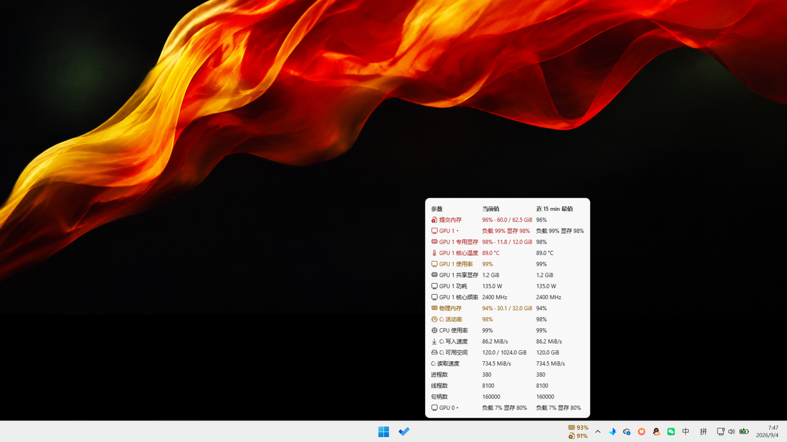

# Windhawk System Resource Alert

**English** · [简体中文](README.zh-CN.md)

*Version 0.8.5 · GPL-3.0-only · Windows 11 x64*

Resource alerts for the Windows 11 taskbar. When any metric stays past its threshold — CPU, memory, disk, GPU, or temperature — a transparent **icon + value** appears beside the system tray. Clicking it opens a rounded overview panel with the full readings.

## Monitored metrics

- CPU load, physical and committed memory
- System drive free space, activity, read/write speed
- Per-GPU load, VRAM and core temperature (up to eight physical cards, each tracked independently)

Rows are omitted when sensor data is missing or stale.

## Behavior

- Alerts sit beside the system tray. Exactly three form a single narrow column; four or more use two rows per column and extend leftward.
- Text and icons are native XAML. The taskbar shows no background and no separate floating window.
- With nothing alerting, the taskbar is left untouched: no entry icon, no reserved space.
- Clicking an alert opens the overview as a three-column table (parameter, current value, worst value in the last 15 minutes), with critical and warning entries first. Rows stay on a single line and the panel adjusts its width to the longest entry; a large number of rows is arranged side by side instead of scrolling.
- Extrema are taken from a rolling 15-minute window of valid samples: free space keeps the low value, other metrics the high. Until the window fills, the available samples are used. Data exists in memory only; no history file is written.
- Each GPU has a collapsible row: load and VRAM when collapsed, with temperature and the remaining readings available after expansion.

Icons: chip = CPU, RAM stick = physical memory, document with a plus = committed memory, drive = free space, gauge = disk activity, down arrow = sustained write, monitor = GPU, memory chip = VRAM, thermometer = temperature.

## Default thresholds

| Metric | Alert | Critical |
| --- | --- | --- |
| CPU load | 95%, sustained ~30s (5s tolerance) | — |
| GPU load | 95%, sustained 30s | — |
| Physical memory | below 10% free and below 4 GiB | below 1% free and below 500 MiB |
| Committed memory | 85% | 95% |
| System drive free space | below 10% and below 10 GiB | below 5% and below 3 GiB |
| System drive activity | 90% for 60s (5s tolerance) | — |
| System drive write speed | ≥5 MiB/s for 180s (5s tolerance) | — |
| Read speed | diagnostic only, no fixed threshold | — |
| VRAM | 90% | 97% |
| GPU core temperature | 80 °C | 87 °C |
| CPU temperature | 90 °C | 95 °C |

A general alert appears after 5 seconds of a sustained condition (2 seconds for critical); recovery requires 10 seconds of valid readings. Amber marks alert level, red critical.

## Install

1. Install and open [Windhawk](https://windhawk.net/).
2. Choose **Create a new mod**.
3. Open [system-resource-alert.wh.cpp](system-resource-alert.wh.cpp), copy its **entire** content, and paste it over the editor template.
4. Press **Ctrl+B** to compile and enable the mod, then adjust thresholds in the mod settings.
5. An empty taskbar means no metric has crossed its threshold. Once an alert appears, click it to open the overview.

This repository provides source code, documentation, and the simulated screenshot, with no prebuilt DLL. Windhawk handles the downloads needed for the first compile and symbol resolution. Updates follow the same flow: replace the whole file and recompile.

Default row height is 18 DIP with zero spacing. For a custom row height, enable **Use custom row spacing** first.

## Data sources

| Reading | Source |
| --- | --- |
| CPU, memory, commit, process/thread/handle counts | Windows system APIs |
| System drive free space | the drive hosting Windows; a fixed personal path is avoided |
| Disk activity, read/write speed | Windows PDH `LogicalDisk` counters; the first sample period establishes a baseline |
| GPU usage and VRAM | NVIDIA NVML when present, with PDH counters |
| GPU core temperature | NVML or Windows D3DKMT, depending on driver support |
| CPU temperature (optional) | LibreHardwareMonitor local web server (port 8085 by default, configurable in settings); older WMI is supported |

For CPU temperature: install and run [LibreHardwareMonitor](https://github.com/LibreHardwareMonitor/LibreHardwareMonitor), enable its web server, and the mod reads `http://127.0.0.1:8085/data.json`. The HTTP client reaches localhost only, with no proxy, redirect, or automatic authentication. Launching LibreHardwareMonitor and installing sensor drivers are left to the user. Without that service, the CPU temperature row is hidden automatically. GPU hotspot, VRAM junction, motherboard, and drive temperatures fall outside the monitored set.

## Compatibility and limitations

- Targets the horizontal taskbar on the primary display of Windows 11 x64.
- The mod relies on internal taskbar structures, which change across system versions; Windows updates or other taskbar mods may affect compatibility. When an unrecognized structure is met, the failure is logged and attaching stops; memory-offset guessing and a floating-window fallback are both avoided.
- Disabling the mod removes its controls and restores the layout it changed.

## Privacy and feedback

The mod reads resource counters, GPU and driver information, system-drive status, the optional local temperature service, and Explorer's taskbar layout (for attaching native controls). All data stays in local memory. The contents and exclusions of this repository are documented in [PRIVACY.md](PRIVACY.md).

To report a problem or request a feature, open an [issue](https://github.com/SinCircle/windhawk-system-resource-alert/issues) with your Windows and Windhawk versions and a short reproduction.

## License and credits

This mod is released under [GNU GPL v3.0](LICENSE), SPDX `GPL-3.0-only`. Parts of the taskbar-hosting code are adapted from m417z's **Taskbar tray icon spacing and grid**; icons come from Microsoft **Fluent UI System Icons** (MIT). Attribution and full licenses are in [THIRD_PARTY_NOTICES.md](THIRD_PARTY_NOTICES.md).
